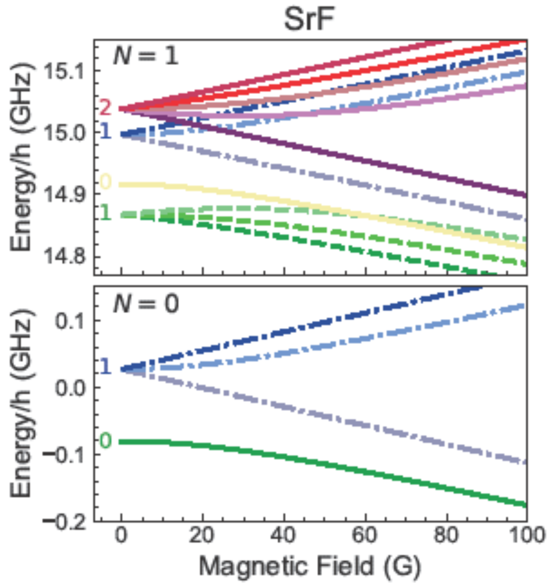

DiPolMol-Py
===========
A Python package to calculate the rotational and hyperfine structure of doublet-Sigma molecules (e.g., CaF, BaF, SrF) in the presence of external fields.

If you use our work for academic purposes you can cite us using:

 B.Humphreys *et al.* DiPolMol-Py: A Python package for calculations for $^{2}{\Sigma}$ ground-state molecules. Add ArXiv link.

Installation
----------
Raw files available on github repository. Further installation options tbc.

Example
-------
.. code-block:: python

	import numpy as np
	import hamiltonian as hamiltonian
	import calculate as calc
	from constants import SrF
	
	Nmax=4 #Identify the maximum N 
	H0,H_B,H_dc,H_ac 
		= hamiltonian.build
			(Nmax,SrF,zeeman=True,Edc=False
              ,Eac=False) 

	B = np.linspace(0,100,5000)*1e-4 #Tesla
	
	H = H_0[..., None] + H_B[..., None]*B
	H = H.transpose(2,0,1)
	
	energies, states, label_list = 
       calc.solve(H, Nmax, SrF,label=True, B)

Resulting plot of above code

For more examples of usage, see the ``./Examples`` folder.
