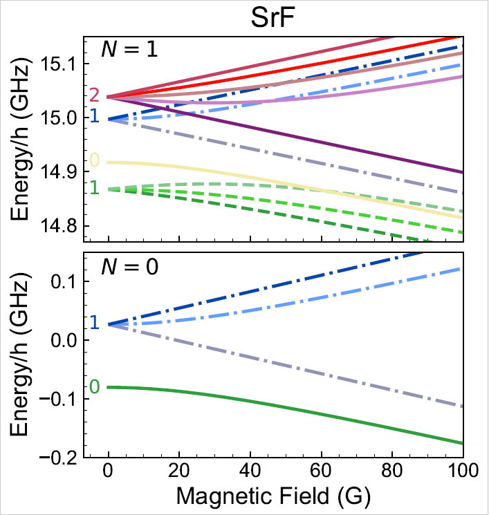

DiPolMol-Py
===========
A Python package to calculate the rotational and hyperfine structure of doublet-Sigma molecules (e.g., CaF, BaF, SrF) in the presence of external fields.

DiPolMol-Py is licensed under a BSD 3 clause license, a copy can be found `here <LICENSE>`_.

If you use our work for academic purposes you can cite us using:

 B.Humphreys *et al.* DiPolMol-Py: A Python package for calculations for $^{2}{\Sigma}$ ground-state molecules (https://arxiv.org/pdf/2503.21663).

Installation
----------
All .py files can be downloaded from the github repository (durham-qlm/DiPolMol).

The repository contains a folder *Programme Files* which includes the main notebooks required to run the programme. There is also a folder *Examples* consisting of various examples of how to calculate different effects.

To run the code, all *Programme Files* must be downloaded and saved, the user can then either copy the example files into the same folder and run them directly or write their own code, saved in the same folder, and importing the Programme files.

Package structure
-------------
**Programme Files:**

*Hamiltonian* – used to build the required Hamiltonian using matrix representation, including the field-free Hamiltonian and in the presence of magnetic, dc electric and off-resonant light fields.

*Calculate* – uses the eigenstates and eigenenergies found from diagonalising the Hamiltonian to run various calculations. Can be used to identify quantum numbers of eigenstates, calculate transition dipole moments and polarisabilities.

*Constants* – includes all known  constants for CaF, BaF and SrF.

**Examples:**

There are three example files for calculating the energy structure in the presence of a magnetic, off-resonant light and electric field (*example_Bfield, example_ac_Efield, example_dc_Efield*). 

There are two files to calculate the electric and magnetic moments of states (*example_electric_moment, example_magnetic_moment*). 

We provide *example_polarisability* to calculate the polarisability for a given wavelength and polarisation of light. 

Finally, *example_tdm* can be used to calculate the transition dipole moment.

Example
-------
.. code-block:: python

	import numpy as np
	import hamiltonian as hamiltonian
	import calculate as calc
	from constants import SrF
	
	Nmax=4 #Identify the maximum N 
	H0,H_B,H_dc,H_ac 
		= hamiltonian.build
			(Nmax,SrF,zeeman=True,Edc=False
              ,Eac=False) 

	B = np.linspace(0,100,5000)*1e-4 #Tesla
	
	H = H_0[..., None] + H_B[..., None]*B
	H = H.transpose(2,0,1)
	
	energies, states, label_list = 
       calc.solve(H, Nmax, SrF,label=True, B)

Resulting plot of above code

For more examples of usage, see the ``./Examples`` folder.
